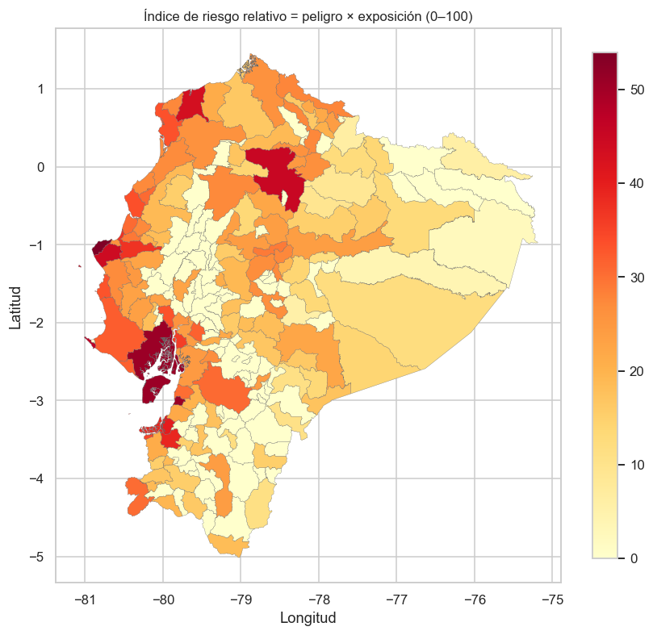
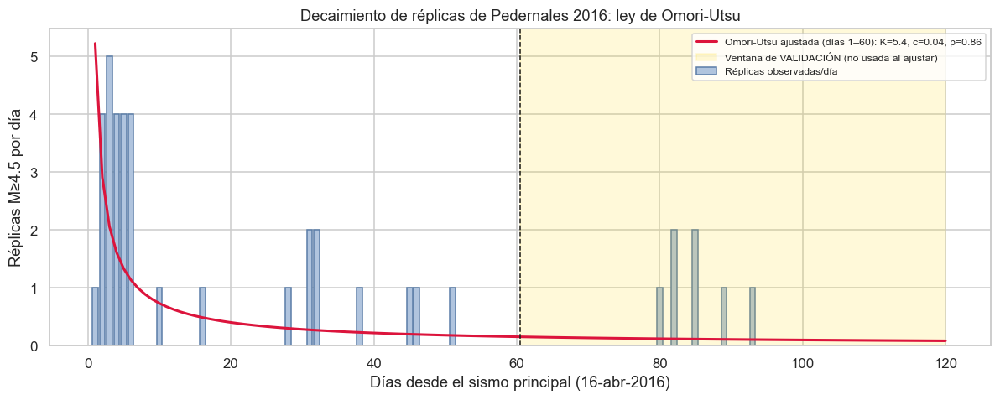
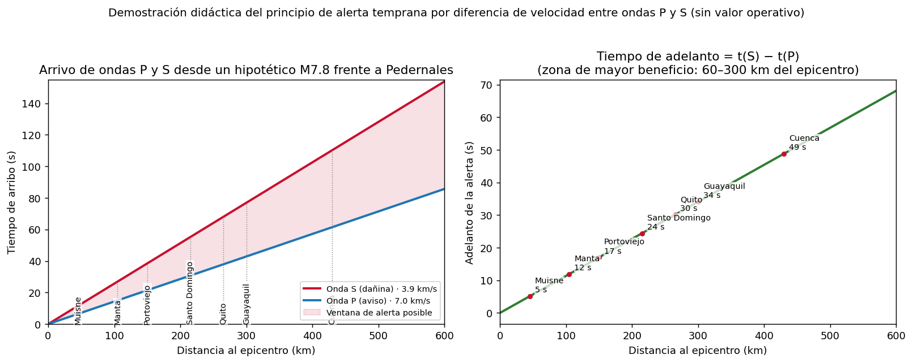

# 🇪🇨 Riesgo Sísmico en Ecuador — Peligro, Exposición y Réplicas (CRISP-DM)

Análisis de ciencia de datos sobre **riesgo sísmico en Ecuador** construido
íntegramente con **fuentes oficiales** y el marco **CRISP-DM**: un índice de
peligro × exposición poblacional por cantón (1983–2026) y un modelo
estadístico de pronóstico de **tasa** de réplicas, calibrado con la secuencia
del terremoto de **Pedernales 2016 (M7.8)**.

> 🌐 **Sitio interactivo (GitHub Pages):** <https://jordanvt18.github.io/riesgo-sismico-ecuador/>
> — mapa coroplético por cantón, gráfico Omori-Utsu interactivo y ranking de riesgo.
> Se regenera con `python src/build_pages.py` (salida en `docs/`).

---

## ⚠️ Lee esto primero: qué SÍ hace y qué NO hace este proyecto

### ❌ Lo que este proyecto NO hace

**NO predice sismos.** Ningún método científicamente validado puede predecir
la fecha, hora, lugar o magnitud exacta del próximo terremoto — ni este
proyecto ni ninguno otro. Así lo declara el [USGS](https://www.usgs.gov/programs/earthquake-hazards/earthquake-prediction)
y es consenso de la sismología global. Todo producto que afirme poder hacerlo
es pseudociencia.

### ✅ Lo que este proyecto SÍ hace

| Producto | Pregunta que responde | Notebook |
|---|---|---|
| **Índice de peligro relativo por cantón** | ¿Dónde se ha concentrado la sismicidad somera y la energía liberada (1983–2026)? | [04](notebooks/04_modeling_peligro_exposicion.ipynb) |
| **Índice de riesgo relativo (peligro × exposición)** | ¿**Dónde es más urgente invertir en construcción sismorresistente**? | [04](notebooks/04_modeling_peligro_exposicion.ipynb) |
| **Pronóstico de TASA de réplicas (Omori-Utsu)** | Tras un gran sismo: ¿cuántas réplicas por día caben esperar y cuánto tarda en decaer? | [05](notebooks/05_modeling_replicas.ipynb) |
| **Validación fuera de muestra** | ¿El modelo de réplicas extrapoló bien a los días 61–120 de Pedernales? | [05](notebooks/05_modeling_replicas.ipynb) y [06](notebooks/06_evaluation.ipynb) |
| **Contraste con la norma NEC** | ¿Coincide el peligro histórico con la zonificación sísmica oficial? | [06](notebooks/06_evaluation.ipynb) |
| **Exploración de embalses (opcional)** | ¿Patrones sísmicos anómalos cerca de Mazar / Paute / Coca Codo Sinclair? *(exploratorio, sin hipótesis de causalidad)* | [06](notebooks/06_evaluation.ipynb) |

El modelo de réplicas estima la **tasa esperada** (réplicas/día) de la
secuencia — una estadística con incertidumbre — y **nunca** eventos
individuales ("habrá una réplica M5 mañana a las 3 pm" no es ciencia).

---

## 📊 Resultados clave

**Top 10 cantones por índice de riesgo relativo** (peligro sísmico somero
histórico × densidad poblacional del Censo 2022; escala 0–100 relativa):

| # | Cantón | Provincia | Peligro | Riesgo |
|---|---|---|---|---|
| 1 | Manta | Manabí | 62.9 | 53.9 |
| 2 | Guayaquil | Guayas | 62.4 | 51.0 |
| 3 | Salinas | Santa Elena | 52.5 | 46.9 |
| 4 | Quito | Pichincha | 55.7 | 45.2 |
| 5 | Montecristi | Manabí | 72.2 | 44.4 |
| 6 | Esmeraldas | Esmeraldas | 67.9 | 43.2 |
| 7 | Machala | El Oro | 46.5 | 40.0 |
| 8 | Santa Rosa | El Oro | 67.3 | 38.9 |
| 9 | Portoviejo | Manabí | 50.9 | 37.2 |
| 10 | Durán | Guayas | 41.2 | 35.8 |



**Lectura:** la franja costera Manabí–Esmeraldas (zona del terremoto de
Pedernales 2016, en la interfaz de subducción) coincide con las grandes
ciudades del litoral y el eje Quito–Guayaquil — exactamente donde peligro y
exposición se solapan.

**Réplicas de Pedernales 2016** (M≥4.5, radio 150 km, 120 días; entrenamiento:
días 1–60, validación: días 61–120). Ley de Omori-Utsu ajustada por máxima
verosimilitud (Poisson no estacionario):

| Parámetro | Valor (±2σ) | Interpretación |
|---|---|---|
| K | 5.4 ± 2.9 | Productividad de la secuencia |
| c | 0.04 ± 0.11 días | Retardo inicial (casi nulo: detección inmediata) |
| **p** | **0.86 ± 0.23** | Decaimiento hiperbólico (rango típico 0.8–1.5) |



**Contraste con la NEC:** la media del peligro histórico por zona normativa
crece con la zona (II: 18.5 < III: 24.3 < IV: 46.0), con la Amazonía (Zona I,
32.1) como excepción explicada por sismicidad cortical de retro-arco que la
norma pondera bajo por atenuación (ρ de Spearman = 0.15, p = 0.03). Detalle
en el [notebook 06](notebooks/06_evaluation.ipynb).

---

## 📁 Estructura del repositorio

```
riesgo-sismico-ecuador/
├── data/
│   ├── raw/                  # Datos oficiales descargados (ver fuentes)
│   └── processed/            # Catálogo limpio, sismos×cantón, índices
├── notebooks/                # CRISP-DM, ejecutables de principio a fin
│   ├── 01_business_understanding.ipynb
│   ├── 02_data_understanding.ipynb
│   ├── 03_data_preparation.ipynb
│   ├── 04_modeling_peligro_exposicion.ipynb
│   ├── 05_modeling_replicas.ipynb
│   └── 06_evaluation.ipynb
├── src/
│   ├── fetch_data.py         # Descarga de fuentes oficiales
│   ├── data_prep.py          # Limpieza, sjoin espacial, agregación, censo
│   └── models.py             # Omori-Utsu (MLE) e índices peligro/riesgo
├── demo/
│   └── demo_alerta_temprana.py   # DEMO EDUCATIVA ondas P/S (no es sistema real)
├── reports/figures/          # Figuras generadas
├── README.md
├── requirements.txt
└── LICENSE
```

## 🔎 Fuentes de datos (todas oficiales o espejos verificados)

| Dato | Fuente oficial | Acceso usado |
|---|---|---|
| Catálogo sísmico 1983–ago 2026 | **IG-EPN** (descarga bajo solicitud) complementado con servicio **FDSN del USGS** (oficial, programático) | [IG-EPN descargas](https://www.igepn.edu.ec/descarga-de-datos/) · [informes de sismos](https://www.igepn.edu.ec/portal/eventos/informes-ultimos-sismosC.html) · [USGS FDSN](https://earthquake.usgs.gov/fdsnws/event/1/) |
| Eventos peligrosos por territorio 2010–2022 | **SNGRE** | [datosabiertos.gob.ec (seguridad y defensa)](https://datosabiertos.gob.ec/dataset/?groups=seguridad-y-defensa) |
| Población por cantón (2022) | **INEC — Censo de Población y Vivienda 2022**, tabulado 1.1 | Espejo público de los CSV oficiales (INEC no expone descarga directa) |
| Límites cantonales | **IGM/CONALI** vía geoBoundaries gbOpen (INEC/OCHA), CC BY 3.0 IGO | [geoBoundaries ECU-ADM2](https://www.geoboundaries.org) |
| Zonificación normativa | **NEC-SE-DS** (Norma Ecuatoriana de la Construcción, 2015) | Consulta del mapa oficial; aquí se usa una aproximación provincial |

> El catálogo del IG-EPN es la referencia nacional; su descarga masiva requiere
> solicitud. Para reproducibilidad programática este proyecto usa el servicio
> FDSN del USGS (también oficial), que incluye los eventos reportados por la
> red regional. Integrar el catálogo IG-EPN es una mejora prevista (ver
> limitaciones).

## 🧪 Metodología resumida

### Peligro × exposición (notebook 04)
1. Catálogo M≥4 1983–2026 → limpieza → unión espacial con los 224 cantones
   (`geopandas.sjoin`); los sismos frente a la costa (subducción) se asignan al
   cantón más cercano en ≤150 km para no subestimar el peligro costero.
2. Por cantón: frecuencia de sismos **someros** (≤70 km, los que gobiernan la
   sacudida) y energía liberada con la escala de Gutenberg-Richter
   (E = 10^(1.5·M+4.8) joules) → **índice de peligro 0–100**.
3. Exposición = densidad poblacional (Censo 2022) normalizada (log).
4. **Riesgo relativo = peligro × exposición**. Coropletas y ranking.

### Réplicas (notebook 05)
- Secuencia de Pedernales 2016 (M≥4.5, radio 150 km, 120 días).
- Ley de **Omori-Utsu** r(t) = K/(t+c)^p ajustada por **máxima verosimilitud**
  (proceso de Poisson no estacionario) con cotas físicas estándar (p ∈ [0.5, 2]).
- Entrenamiento días 1–60; **validación fuera de muestra** días 61–120.
- Pronostica la **tasa diaria esperada**, no eventos individuales.

### Evaluación (notebook 06)
- Métricas RMSE/MAE/correlación y residuos del modelo de réplicas.
- Contraste cualitativo con la zonificación **NEC** (aproximación provincial).
- Exploración (sin hipótesis causal) de sismicidad M≥3 cerca de Mazar, Paute y
  Coca Codo Sinclair, antes/después de su operación.

## 🚀 Cómo ejecutar

Requisitos: Python ≥ 3.10.

```bash
pip install -r requirements.txt

# 1) Descargar datos oficiales (catálogo USGS-FDSN, cantones, censo)
python src/fetch_data.py

# 2) Pipeline de preparación (sjoin + censo + agregaciones)
python src/data_prep.py

# 3) Notebooks (ejecutables en orden 01 → 06)
jupyter lab notebooks/

# 4) (Opcional) Demo educativa de ondas P/S
python demo/demo_alerta_temprana.py
```

## 🧑‍🏫 Demo educativa: alerta temprana P/S

`demo/demo_alerta_temprana.py` ilustra **el principio físico** de los sistemas
de alerta temprana: la onda P viaja ~1.8× más rápido que la S, y esos segundos
de diferencia se pueden convertir en aviso. **Es una demo educativa, no un
sistema real** — no está conectada a sensores y no sirve para decisiones de
seguridad. Ecuador no dispone al 2026 de un sistema público nacional de
alerta temprana sísmica.



## ⚠️ Limitaciones (honestidad ante todo)

1. **No es PSHA.** El índice no calcula probabilidad de excedencia de
   aceleración ni reemplaza la zonificación normativa NEC; es un ranking
   relativo para priorización.
2. **Sin atenuación.** No se modela cómo decae la sacudida con distancia y
   tipo de fuente (por eso filtramos a eventos someros ≤70 km).
3. **Exposición simplificada.** Solo densidad de residentes (Censo 2022); no
   edificaciones, tipologías estructurales ni ocupación horaria.
4. **Un solo catálogo** (USGS-FDSN). Integrar el catálogo oficial IG-EPN
   (M≥1–2, bajo solicitud) mejoraría réplicas y la exploración de embalses.
5. **Réplicas:** Omori-Utsu asume un solo sismo principal; secuencias con
   sub-choques (como el M6.9 del 18-may-2016) requieren ETAS.
6. Cantones homónimos (Bolívar, Olmedo — dos provincias cada uno) comparten
   clave de nombre en el cruce; afecta a 4 de 224 filas.

## 🗺️ Mapa CRISP-DM del proyecto

| Fase CRISP-DM | Dónde está |
|---|---|
| 1. Comprensión del negocio | `01_business_understanding.ipynb` |
| 2. Comprensión de los datos | `02_data_understanding.ipynb` |
| 3. Preparación de los datos | `03_data_preparation.ipynb` + `src/data_prep.py` |
| 4a. Modelado peligro × exposición | `04_modeling_peligro_exposicion.ipynb` + `src/models.py` |
| 4b. Modelado réplicas | `05_modeling_replicas.ipynb` + `src/models.py` |
| 5/6. Evaluación y conclusiones | `06_evaluation.ipynb` |

## 📜 Licencia y créditos

- Código: [MIT](LICENSE). Datos: según cada fuente oficial (IG-EPN/USGS
  públicos; INEC censo 2022 uso libre citando fuente; geoBoundaries CC BY 3.0 IGO).
- Autor: **[@jordanvt18](https://github.com/jordanvt18)** · Proyecto educativo
  de ciencia de datos abierta, hecho como aporte a la gestión del riesgo sísmico
  de Ecuador.
- Agradecimientos: IG-EPN, INEC, IGM, SNGRE y USGS por mantener datos públicos;
  y a la comunidad sismológica global por la ciencia abierta en la que se basa
  este trabajo.

> *"Los sismos no se pueden predecir, pero sus consecuencias sí se pueden
> reducir."* — principio rector de este repositorio.
